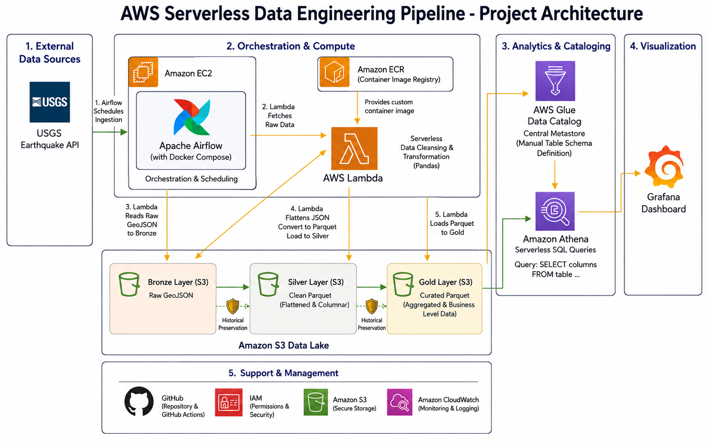

# 🌎 AWS Serverless Data Engineering Pipeline

> An End-to-End, Production-Grade Data Engineering Pipeline built on AWS to extract, transform, and visualize global earthquake data using a Medallion Architecture (Bronze to Silver).


---

## 📌 Project Overview

This project demonstrates a fully functional **Serverless Data Engineering Pipeline** running on **Amazon Web Services (AWS)**.

The pipeline automatically orchestrates the ingestion of real-time global earthquake data from the USGS API, cleans and transforms the nested JSON payloads, and stores them in an analytics-ready Parquet format within a Data Lake (Amazon S3). Finally, the data is cataloged via AWS Glue and visualized through a Grafana dashboard using Amazon Athena as a serverless SQL engine.

**Key Highlights & Problem Solving in this Project:**

- **Serverless Transformation:** Handled dynamic Python code execution within AWS Lambda.
- **Complex Data Handling:** Flattened complex nested arrays (GeoJSON coordinates) into structured columns (Latitude, Longitude, Depth) using Pandas to optimize Amazon Athena query performance.
- **Data Cleansing:** Filtered out non-earthquake events and handled missing values dynamically before sinking data to the Silver layer.
- **Cost Optimization:** Leveraged AWS Free Tier, Spot Instances for EC2, and a pay-as-you-go serverless architecture.

---

## 🏗️ Architecture

*(Please refer to the high-resolution architecture diagram provided in the docs folder for detailed steps)*

<p align="center">
  
</p>

---

## 🚀 Technology Stack

### ☁️ Cloud Infrastructure (AWS)

- **Amazon EC2:** Compute instance (Spot/Free Tier) hosting Apache Airflow and Grafana via Docker.
- **Amazon S3:** Data Lake storage separating raw data (Bronze) and clean data (Silver).
- **AWS Lambda:** Serverless compute for fetching APIs and running Pandas transformations (allocated with 1GB RAM to prevent Out-Of-Memory errors).
- **Amazon ECR:** Registry for custom Docker images deployed to AWS Lambda.
- **AWS Glue Data Catalog:** Metastore for manual schema definition of Parquet files.
- **Amazon Athena:** Serverless interactive query service to analyze data in S3 using standard SQL.
- **Amazon EBS & AWS CLI:** Persistent storage management and infrastructure interaction via terminal.

### 🛠️ Data Engineering & Orchestration

- **Apache Airflow:** Workflow orchestration and scheduling (running in Docker with volume mounts).
- **Python (Pandas):** Core language for data extraction, cleansing, and nested JSON flattening.
- **Docker & Docker Compose:** Containerization for consistent environments across local and cloud.

### 📊 Visualization

- **Grafana:** Dashboarding tool connecting directly to Athena to build conditional visual alerts (e.g., Pie charts with Thresholds and Field Overrides).

---

## 🔄 Pipeline Workflow

*(The steps below correspond directly to the pipeline's Medallion Architecture)*

### 1. Ingestion Layer (API ➡️ Bronze / Staging)

- **Apache Airflow** triggers an AWS Lambda function on a scheduled basis.
- Lambda fetches real-time earthquake data strictly from the **USGS API**.
- Raw data is ingested in its native **GeoJSON** format and loaded directly into the **Amazon S3 Bronze Layer** for historical preservation.

### 2. Transformation Layer (Bronze ➡️ Silver / Fact)

- A secondary task reads the GeoJSON from the Bronze Layer.
- **Pandas** is used to flatten nested structures (e.g., extracting `latitude`, `longitude`, and `depth` from the `geometry.coordinates` array).
- Data cleansing is performed to handle null values and filter specific event types (e.g., ensuring `properties.type = 'earthquake'`).
- The cleaned dataset is written to the **Amazon S3 Silver Layer** in **Apache Parquet** format for columnar storage efficiency.

### 3. Aggregation Layer (Silver ➡️ Gold / Data Mart)

- Cleaned and structured data from the Silver layer is further processed and aggregated to build business-ready data models (such as fact tables or regional summaries).
- The final business metrics and summaries are loaded into the **Amazon S3 Gold Layer**, serving as a high-performance **Data Mart** optimized for analytics and dashboard consumption.

### 4. Cataloging & Analytics (Gold ➡️ Analytics)

- Table schemas and data types (VARCHAR, TIMESTAMP, DOUBLE) are manually defined in the **AWS Glue Data Catalog** targeting the Parquet datasets in S3.
- **Amazon Athena** connects to the catalog, enabling seamless serverless SQL querying.

### 5. Visualization

- **Grafana** is linked to Amazon Athena as a data source, querying directly from the Gold/Silver tables.


## 📂 Project Structure

```text
aws-data-pipeline/
│
├── .github/
│   └── workflows/
│       └── deploy_lambda.yml
│
├── dags/
│   ├── earthquake_dag.py
│   └── hello_dag.py
│
├── docs/
│   └── architecture.png
│
├── lambda/
│   └── transformers/
│       ├── dim_earthquake.py
│       ├── gold_earthquake.py
│       └── transform_earthquake.py
│
├── scripts/
│   ├── extractors/
│   │   └── extract_earthquake.py
│   └── utils/
│
├── .gitignore
└── README.md
```
